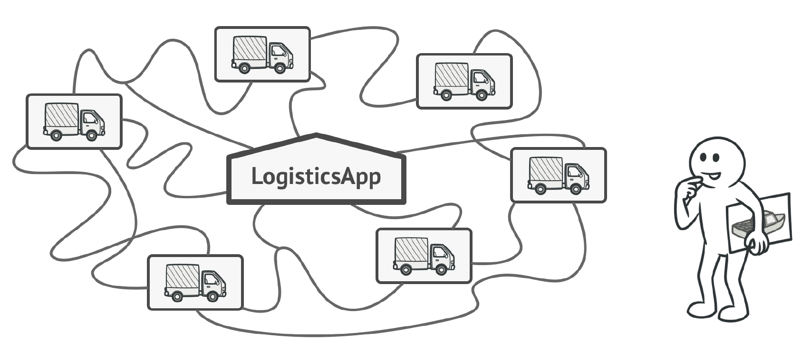

### Hi there 👋

<!--
**alejandrozeb/alejandrozeb** is a ✨ _special_ ✨ repository because its `README.md` (this file) appears on your GitHub profile.

Here are some ideas to get you started:
-->

- 🔭 I’m currently working on ...
- 🌱 I’m currently learning ...
- 👯 I’m looking to collaborate on ...
- 🤔 I’m looking for help with ...
- 💬 Ask me about ...
- 📫 How to reach me: ...
- 😄 Pronouns: ...
- ⚡ Fun fact: ......

  
    ¡Hola! Soy backend developer aquí puedes encontrar todos los apuntes de cursos que realice hasta el momento que lees esto tambien puedes navegar entre commits e ir viendo como va evolucionando cada proyecto.
    Si alguna vez tuve el gusto de ¡enseñarte! el repositorio de la clase esta resaltado si no puedes buscar en la parte de repositories te puedo asegurar que lo encontraras facilmente ya que tendra un nombre bastante claro.
    Además, me gusta bastante la arquitectura de software voy implementando diferentes arquitecturas en proyectos que pienso que pueden aportar a la sociedad por ahora estoy implementando:
    Arquitectura n capas con algunas capas transversales en un Asistente de Ansiedad Estres y Depresion.
     
    Estas son la herramientas con las que estoy familiarizado:
    Lenguajes de programación: SQL, Php, Javascript y python.
    Frameworks back-end: Codeigniter, Express y Laravel.
    Motores de bd: Mysql, Oracle y Sqlserver.
    ORM's: MongoDb, Sequelize y Eloquent.
    Frameworks front-end: Angular y React.
    Frameworks Css: Materialize, Materialize.io, Boostrap3 y Boostrap4 (ademas de algunos motores de plantillas propios de los frameworks).

    